# Visual Studio Code + Remote - SSH

#### Relevant links

[Visual Studio Code (vscode)](https://code.visualstudio.com/docs)

[Remote - SSH](https://marketplace.visualstudio.com/items?itemName=ms-vscode-remote.remote-ssh)

### What is it?

`Remote - SSH` is an extension that makes it really easy to work on a remote server over ssh, built by Microsoft for their code editor `vscode`.

### Getting Started

 * Install [Visual Studio Code](https://code.visualstudio.com/download)
 * Install Remote - SSH
   * Open Visual Studio Code
    
    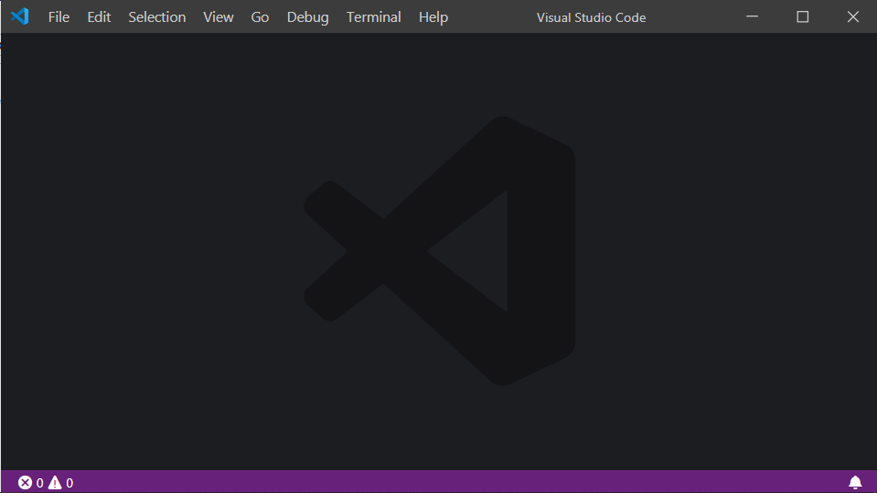

   * Show extensions in sidebar (`⇧⌘X` on Mac, `Ctrl+Shift+X` on Windows)
    
    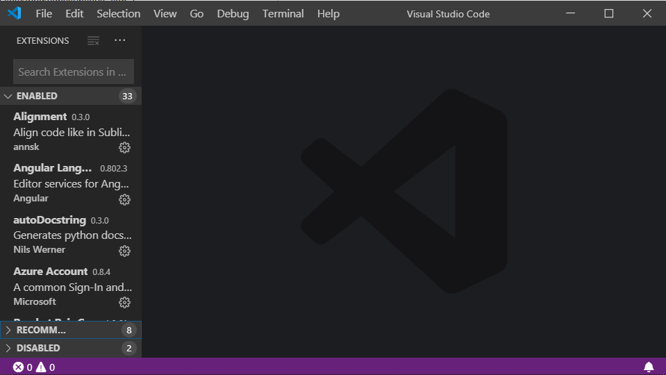

   * Install `Remote - SSH`
    
    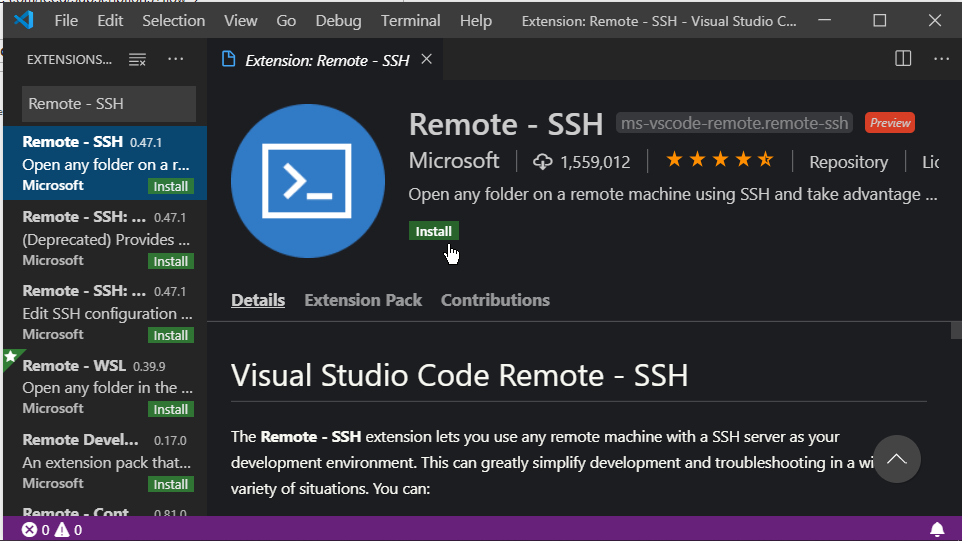

 * Configure `Remote - SSH`
   * Click on the `><` symbol in the bottom left corner
    
    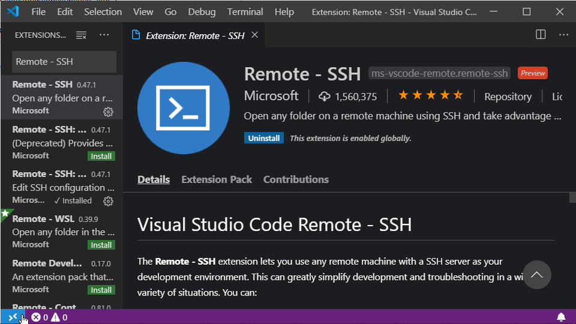

   * Click on `Remote - SSH: Connect to Host...`
    
    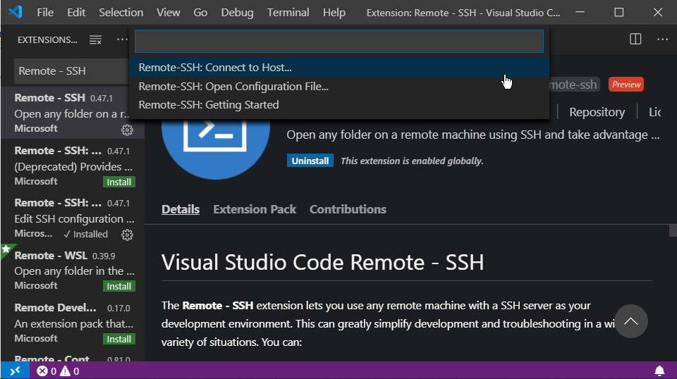

   * Click on `+ Add New SSH Host...`
    
    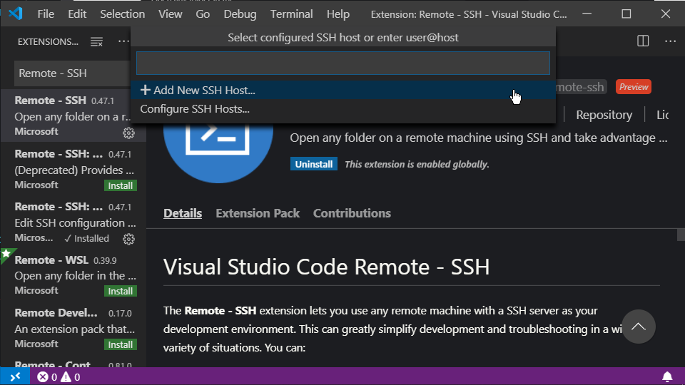

   * Enter your ssh connection command
    
    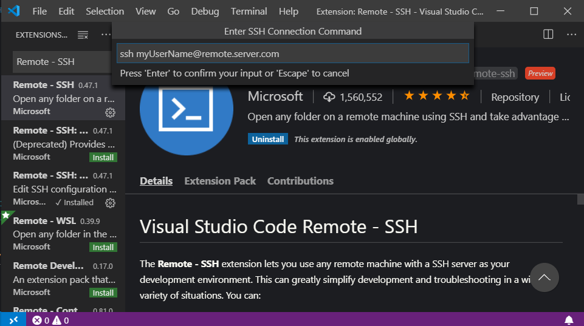

   * Select the SSH configuration file to update. (When in doubt, use the one local to your user)
    
    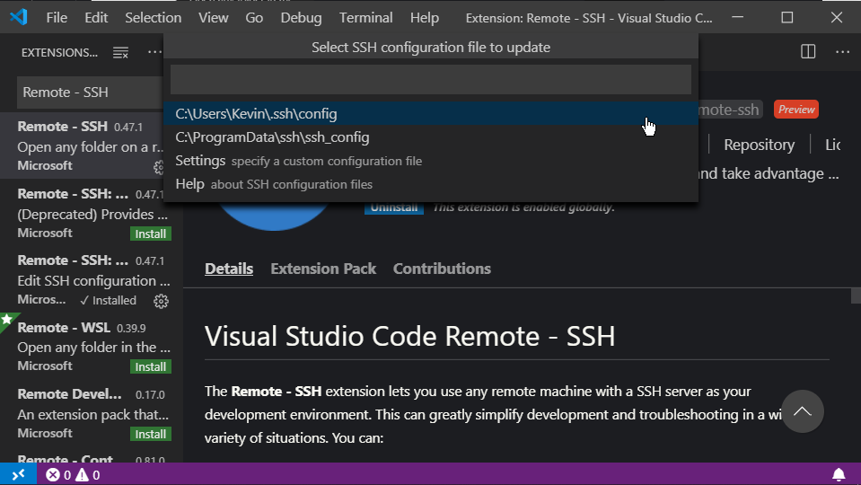


### To use

 * Click on the `><` symbol in the bottom left corner
  
  

 * Click on `Remote - SSH: Connect to Host...`
  
  

 * Click on name of the host you want to connect to
  
  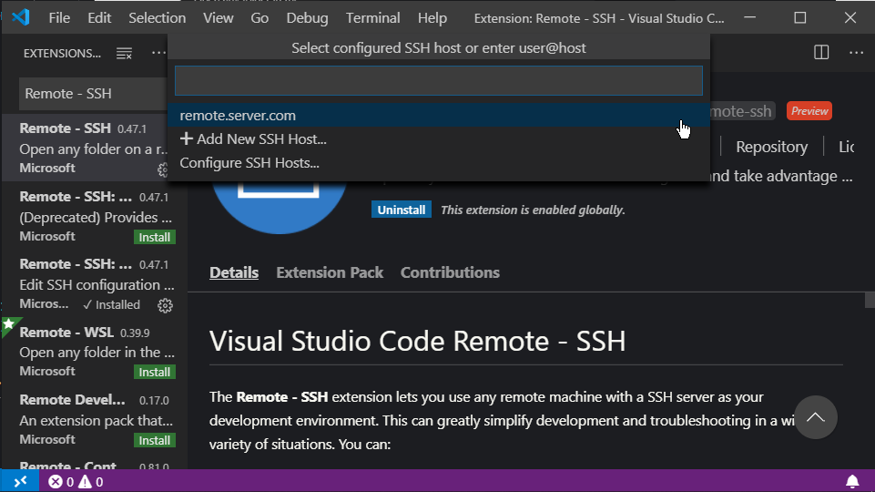

 * In the new window that opens, enter your password if prompted
  
  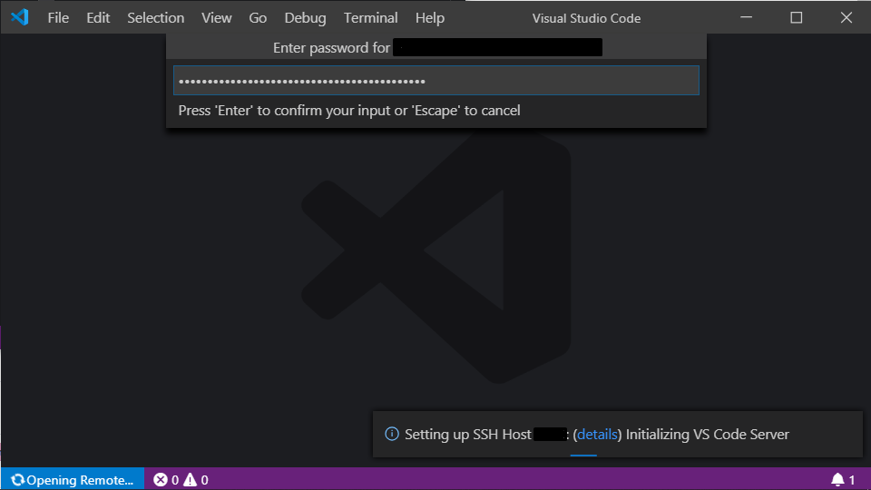

 * On success, you should see `SSH: NAMEOFYOURSERVER` in the bottom left corner
  
  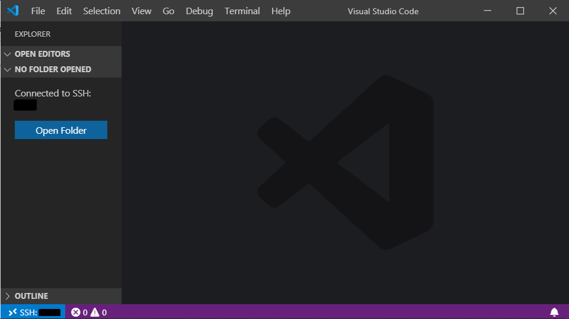
  
  *Note: Sometimes on Windows, the first connection after you configure a host will fail. But it'll usually work if you try again*


  You should be able to click on `Open Folder` (if you can't see it, Toggle the Sidebar [`⌘B`, `Ctrl+B`] then show the explorer pane [`⇧⌘E`, `Ctrl+Shift+E`]) to open a folder on the remote server.

  The inbuilt terminal (`` ⌃` ``,`` Ctrl+` ``) should also automatically open to the currently opened folder.

### Appendix 1: Limiting disk usage of C++ Extension

The C++ extension can easily use multiple gigabytes of storage at a time, which can make it unusable in settings where users have a small disk quota.

Adding the following to your settings for the remote host can help mitigate the disk usage and keep it a more reasonable figure (300-400MB vs 1GB+).

```jsonc
{
        "C_Cpp.intelliSenseCacheSize": 90,
        // https://github.com/microsoft/vscode/issues/22557
        "C_Cpp.default.browse.databaseFilename": "~/.vscode-cpptools/vc.db"
}
```

Get to your remote host settings by doing the following 
 * Connect to the host that the C++ extension is installed on
 * Clear the C++ extension's cache
    * On a linux machine, by default this can be done by running `rm -rf ~/.vscode-cpptools/ipch/* ~/.vscode-server/data/User/workspaceStorage/*`
 * Open the Command Pallette (`⇧⌘P` on Mac, `Ctrl+Shift+P` on Windows) and search for `Preferences: Open Remote Settings (SSH: INSERT_YOUR_HOSTNAME_HERE)`
 * Paste to above settings into your settings file.

### Appendix 2: Key based Authentication

It is possible to use an `ssh key` that is tied to your computer to authenticate to a remote server instead of a password. The key is authenticated automatically, without user interaction which can make `Remote - SSH` far more convenient to use.

Instructions can be found [here](https://code.visualstudio.com/docs/remote/troubleshooting#_quick-start-ssh-key)


### Things to be aware of

* When using Remote - SSH, installing extensions will place the extension's file on the remote server. This can cause issues if you have a small disk quota and install extensions with large files.
